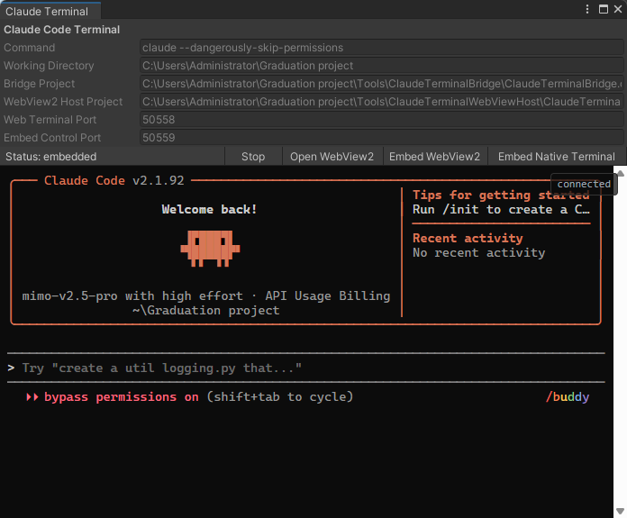
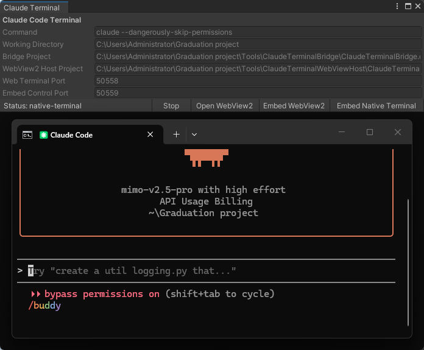

# Claude Code Terminal for Unity

语言：[English](README.md) | 简体中文

把 Claude Code 终端放进 Unity 编辑器里的 `EditorWindow` 工具包。

这个包提供 `Window / Claude Code Terminal` 菜单，核心能力是：

- `Embed WebView2`：把接近原生 Claude Code 的终端界面嵌入 Unity 面板区域。
- `Embed Native Terminal`：作者开发用的实验模式，打开真正的 Windows `cmd.exe` Claude Code 会话，并放到 Unity 面板区域附近。这个模式保留 Windows 原生输入法体验，但不是完善的普通用户嵌入模式。
- `Open WebView2`：用独立 WebView2 窗口打开同一个终端界面。
- `Stop`：结束当前由工具启动的 Claude Code 终端会话。
- 检测外部已连接 Unity MCP 的 Claude Code 会话，避免不小心开多个会话。
- 支持中文输入法、粘贴、多行粘贴和常用终端快捷键。
- Unity 进入 Play Mode 时保留终端会话，不会因为运行游戏而直接结束进程。

## 运行截图

### Embed WebView2



### Embed Native Terminal



## 安装

在 Unity 中打开：

```text
Window / Package Manager / + / Add package from git URL...
```

把这个仓库地址粘贴进去：

```text
https://github.com/ninkjin/Claude-Code-Terminal-for-Unity.git#upm
```

`upm` 分支是给 Unity Package Manager 使用的轻量发布分支。`main` 分支保留开发源码，体积更大。只有你想查看或修改源码项目时，才建议使用 `main`：

```text
https://github.com/ninkjin/Claude-Code-Terminal-for-Unity.git#main
```

## 前置条件

- Windows + Unity 2022.3 或更高版本。
- 已安装 Claude Code CLI，并且命令行里可以直接运行 `claude`。
- Microsoft Edge WebView2 Runtime。大多数 Windows 10/11 机器已经自带；如果 WebView2 窗口打不开，再手动安装即可。
- 如果要让 Claude Code 操作 Unity，需要按你的 Unity MCP 插件方式启动并连接 MCP。

这个包已经内置 Windows x64 预构建程序：

- `Tools/ClaudeTerminalBridge`
- `Tools/ClaudeTerminalWebViewHost`

普通用户不需要安装 .NET SDK。源码项目保留在 `Tools~` 目录下给开发者使用；只有你想修改并重新构建 bridge 或 WebView2 host 时，才需要安装 .NET 8 SDK。

## 使用

安装后打开：

```text
Window / Claude Code Terminal
```

常用流程：

1. 确认 `Command` 是 `claude`。
2. 确认 `Working Directory` 是当前 Unity 项目的根目录。
3. 点击 `Embed WebView2`，在 Unity 面板内使用 Claude Code。
4. 普通使用建议优先点击 `Embed WebView2`。`Embed Native Terminal` 主要保留给作者开发和测试原生 Windows 输入法体验。
5. 需要独立 WebView2 窗口时，点击 `Open WebView2`。
6. 需要关闭当前会话时，点击 `Stop`。

## 设置项

- `Command`：启动 Claude Code 的命令，默认是 `claude`。
- `Working Directory`：Claude Code 的工作目录，默认是当前 Unity 项目根目录。
- `Bridge Project`：终端桥接程序 `.csproj` 路径，默认自动指向包内 `Tools/ClaudeTerminalBridge`。
- `WebView2 Host Project`：WebView2 宿主程序 `.csproj` 路径，默认自动指向包内 `Tools/ClaudeTerminalWebViewHost`。
- `Web Terminal Port`：xterm.js 终端网页服务端口，默认 `50558`。
- `Embed Control Port`：嵌入模式下 Unity 与 WebView2 宿主通信的控制端口，默认 `50559`。

## 已知限制

- `Embed WebView2` 使用外部 WebView2 窗口覆盖到 Unity 面板区域，不是 Unity 原生 IMGUI 控件。
- `Embed Native Terminal` 是作者开发用的实验功能，不是稳定的内嵌终端；它不是真正把 cmd 变成 Unity 控件，而是启动真实 cmd 窗口并把它放到面板区域附近。
- `Embed Native Terminal` 的已知问题：只能在 idle 状态先调整好 Claude Code Terminal 面板大小，再启动 native 模式；运行中调整窗口大小不可靠。点击 Unity 的其他区域后，终端区域可能黑屏；拖动一下 Claude Code Terminal 窗口通常可以刷新回来。窗口焦点、层级和任务栏行为仍然遵循 Windows 规则。
- 当前主要验证 Windows 环境，macOS/Linux 暂未适配。
- 如果外部 cmd 里已经有连接 Unity MCP 的 Claude Code，工具会提示你先确认是否继续。
